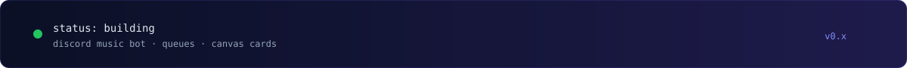

<div align="center">
  
</div>

<br/>

<div align="center">
  
</div>

<br/>

<p align="center">
  
  
  
  
  
</p>

---

### System

```text
Discord Gateway
      │
      ├── Commands ──▶ Queue Engine ──▶ Voice / Lavalink
      │
      └── Card Renderer  (nowPlaying · startSong · addSong)
               │
               └── Redis / DB  (session · rate limits)
```

| Event | Bar | Shows |
|-------|-----|--------|
| `nowPlaying` | on | time + volume |
| `startSong` | off | started state |
| `addSong` | off | queue position |

---

### Stack

**Runtime** — Node 18/20, TypeScript  
**Bots** — discord.js v14, Lavalink  
**Data** — Redis, MongoDB / PostgreSQL  
**Render** — `@napi-rs/canvas`  
**Ops** — Docker, GitHub Actions  

---

### Contact

<p align="center">
  <a href="https://github.com/motaz-darawsha"></a>
  <a href="mailto:motazdarawsha@gmail.com"></a>
</p>

<div align="center">
  
</div>
