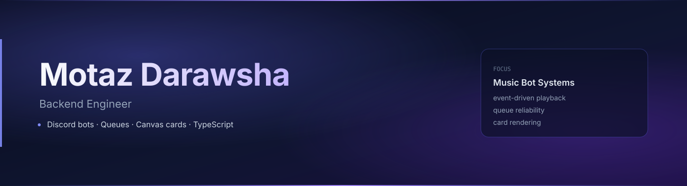

  

 

Backend engineer. I work in **Node.js** and **TypeScript**.

Most days that means APIs, bots, and the infrastructure around them — queues, sessions, things that have to keep working when more than one user shows up.

  
  
  
  
  
  

---

**Right now:** building a Discord music bot — playback events, queue logic, canvas cards.

**Contact:** [motazdarawsha@gmail.com](mailto:motazdarawsha@gmail.com)
